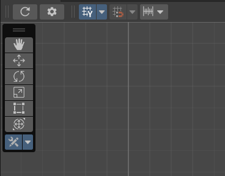
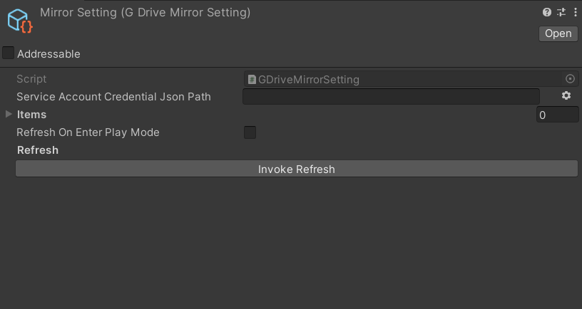
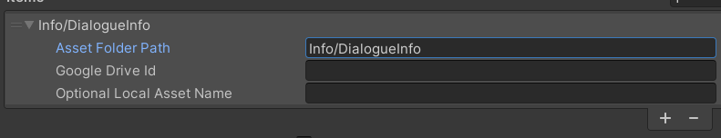

# ☁️ GDriveMirror – Get Started

**GDriveMirror** lets you sync spreadsheet data directly from Google Drive into your Unity `Assets/Info` folder.

> 🧩 Great for game designers working with `.xlsx` sheets — no more manual exports!

---

## 🎛️ How to Use

### 1. Open GDriveMirror

Click the **bottom-most toolbar button** shown below to open the settings:



Alternatively, you can open the settings directly from the project folder:  
`Assets/GoogleDrive/MirrorSetting.asset`

---

### 2. Configure Mirror Settings

In the settings window:



- **Service Account Credential JSON Path**  
  Enter the full path to your Google service account key file.  
  You can also click the gear button to browse manually.

- **Refresh On Enter Play Mode**  
  Tick this if you want Unity to auto-refresh files each time you hit play.

- **Invoke Refresh**  
  Press this button to manually sync all items from Google Drive.

---

### 3. Add Mirror Items

Each item represents one file to sync:



- **Asset Folder Path**: Local folder in `Assets/Info/` to store the data.
- **Google Drive ID**: The file ID found in the Google Drive share URL.
- **Optional Local Asset Name**: Optional custom filename (without extension).  
  If left blank, it uses the original file name from Drive.

---

## 💡 Tips

- Drive file URL:  
  `https://drive.google.com/file/d/**YOUR_FILE_ID**/view`

- Files are pulled in as raw bytes (usually `.xlsx` or `.csv`) and can be loaded using your own import logic.

---

## ✅ Example

Google Drive:
```
MyDrive/
└── Dialogue.xlsx (ID: abc123)
```

Mirror Item:
```
Asset Folder Path: Info/DialogueInfo
Google Drive ID: abc123
```

→ Synced result:
```
Assets/Info/DialogueInfo/Dialogue.xlsx
```
